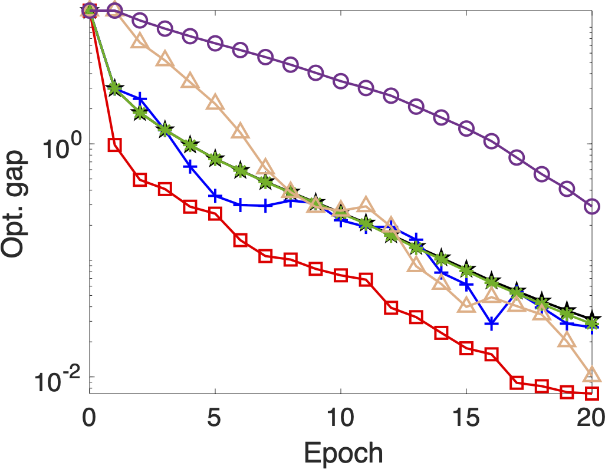
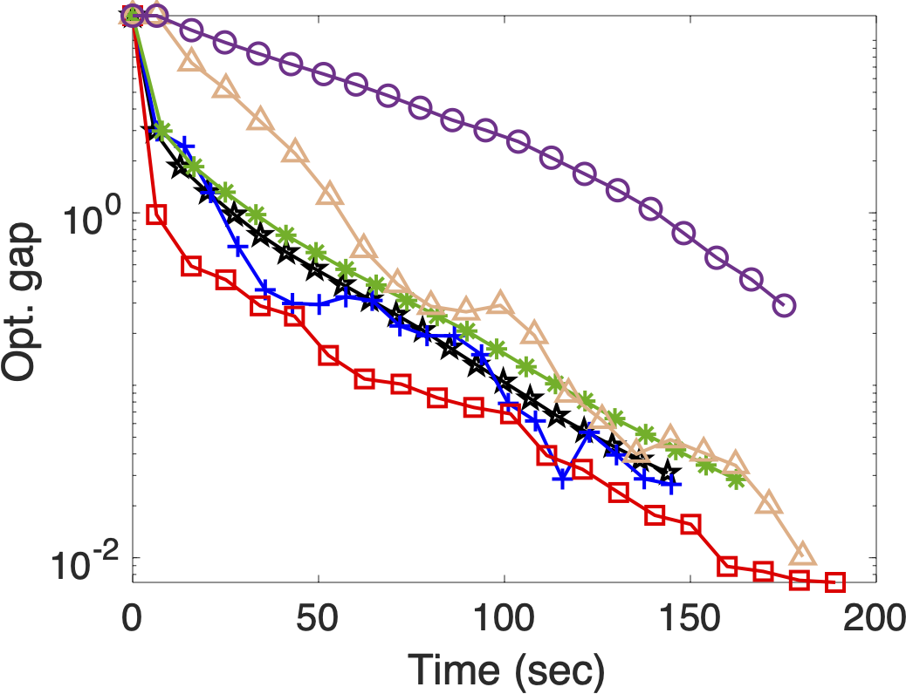
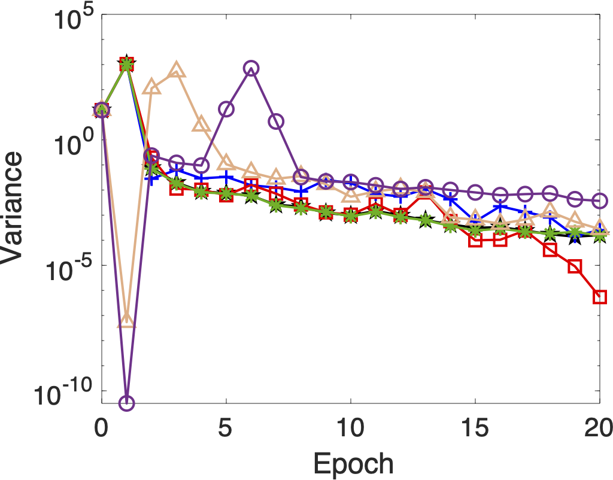

# SVRGBB: Stochastic Variance Reduced Gradient with Barzilai-Borwein Approximation

This repository contains MATLAB implementations and experimental results for various **Stochastic Variance Reduced Gradient (SVRG)** methods, with a particular focus on novel approaches incorporating the **Barzilai-Borwein (BB) approximation**. We consider improving the stochastic variance reduce gradient (SVRG) method by incorporating the curvature information of the objective function. We propose to reduce the variance of stochastic gradients using the computationally efficient Barzilai-Borwein (BB) method by incorporating it into the SVRG. We also incorporate a BB-step size as a variant. We conduct the numerical experiments on the benchmark datasets and demonstrate that the proposed method with a constant step size outperforms the existing variance reduced methods for some test problems.

The project is designed to efficiently solve large-scale machine learning optimization problems, specifically **L2-regularized logistic regression** and **L2-squared Support Vector Machine (SVM)** tasks.

📄 The research is detailed in the accompanying paper:  
**"[SVRG-2 using BB-approximation] A Stochastic Variance Reduced Technique using Barzilai-Borwein techniques as second order information"**

---

## 📂 Table of Contents
- [Project Structure](#project-structure)
- [Objective Functions](#objective-functions)
- [Key Files](#key-files)
- [Running Experiments](#running-experiments)
- [Results and Figures](#results-and-figures)
- [Performance on Gisette Dataset](#performance-on-gisette-dataset)
- [Citation](#citation)

---

## 📁 Project Structure

```bash
SVRGBB/
├── SGD_lib/                    # Utility tools for learning rate, epochs, etc.
├── SVRG_BB/                    # Main repo for SVRG-2BB proposed method
│   ├── data/w8a.m              # Datasets (MAT files - eg. w8a.mat) and data loaders(w8a.m)
│   ├── Results_2022/           # Results from 2022 experiments
│   ├── Results_July2022/       # Latest experiment results
│   ├── BB_optimizers/bb_solvers/ # Core implementations of SVRG-BB methods
│   └── Problem/                # Loss functions, gradients, BB updates
├── Figures/
│   ├── adult/
│   ├── w8a/
│   ├── covtype/
│   ├── gisette/
│   ├── mnist38/
│   ├── ijcnn/
│   └── Figure_M1_M4/
├──SVRG_NUMERICAL_EXP.m    # Main experiment script
└── README.md
```

---

## 🧮 Objective Functions

This project addresses two main objective functions in convex optimization:

### 1. L2-Regularized Logistic Regression:

$$
\min_w F(w) = \frac{1}{n} \sum_{i=1}^n \log(1 + \exp(-b_i a_i^T w)) + \frac{\lambda}{2} \|w\|^2
$$

### 2. L2-Squared Support Vector Machine (SVM):

$$
\min_w F(w) = \frac{1}{2n} \sum_{i=1}^n (\max(0, 1 - b_i a_i^T w))^2 + \frac{\lambda}{2} \|w\|^2
$$

### Where:
* $a_i \in \mathbb{R}^d$: Feature vector
* $b_i \in \{ \pm 1 \}$: Binary label
* $\lambda$: L2 regularization parameter

---

## 🗂️ Key Files

- **`SVRG_NUMERICAL_EXP.m`**  
  Main script to run experiments across datasets and SVRG variants. Handles configuration, execution, and result logging.

- **`ploter.m`**  
  Script in `Figures/` to generate `.eps` plots for optimality gap, variance, and convergence diagnostics.

- **`W8A.mat`** and **`W8A.m`** are
  Example data loader and preprocessor for the W8A dataset.

- **`JIMO_SVRG_2BB.pdf`**  
  Full research paper with theoretical guarantees, algorithm derivations, and benchmark results.

---

## ▶️ Running Experiments
0. First of all add the whole folder in MATLAB path.
1. Ensure MATLAB (R2019a or later) is installed.
2. Navigate to the experiment file
3. Run the experiment script:

```matlab
SVRG_NUMERICAL_EXP();
```

Results will be saved in `Results_July2022/` or `Results_2022/` automatically.

---

## 📈 Results and Figures

After running the main script, generate performance figures:

1. Navigate to:

```matlab
cd SVRGBB/Figures/
```

2. Run:

```matlab
ploter();
```

This creates `.eps` plots stored in subfolders like `Figures/adult/`, `Figures/gisette/`, etc., which you can convert to PNG/PDF for presentations.

---

## 📊 Performance on Gisette Dataset

The Gisette dataset is used to benchmark convergence speed and variance reduction.

### Gisette dataset: $n = 6000 , d = 5001 \text{ and } \lambda = 1e-5 $

#### 1. Optimality Gap vs. Epoch
Convergence behavior of SVRG variants showing reduction in cost per epoch and SVRG-2BB is outperforms other methods.

<!--[Legend](Figures/Legend.png) -->



#### 2. Optimality Gap vs. CPU Time
Illustrates computational efficiency of each SVRG variant. Also, SVRG-2BB outperforms other methods.





#### 3. Variance vs. Epoch
Demonstrates variance reduction across epochs for stochastic gradients.




---

## 📚 Citation

**Tankaria Hardik, & Yamashita Nobuo**
*[A Stochastic Variance Reduced Technique using Barzilai-Borwein techniques as second order information](https://www.aimsciences.org/article/doi/10.3934/jimo.2023089)*  
**Journal of Optimization, Industry, and Management. 2024, 20(2): 525-547**
